# Tutorials Collection

made with :heart: from 42 BKK Team

---
## Prerequisite ##

- knowledge about <span style="font-weight:bold">RTFM</span>
- Basic bash shell knowledge
- VSCode <span style="font-weight:bold">(NOT VS Studio) </span>
- Docker Desktop
    <span style="font-weight:bold">MUST BE LASTEST VERSION AND OPENED </span>

---

### Do take note

`$` mean its a shell command
just copy everything <span style="font-weight:bold">AFTER</span> `$`
and run it as is
<br>
`<name>` replace the whole thing with your input including the `<>`

---

### Table of content
1. [Setting up workspace](#4)

---
## Setting up workspace

- [Setting up Dev container](#6)
- [Generating ssh-key](#24)
- FAQ

---
# <span style="color:white">Setting up Dev container </span>

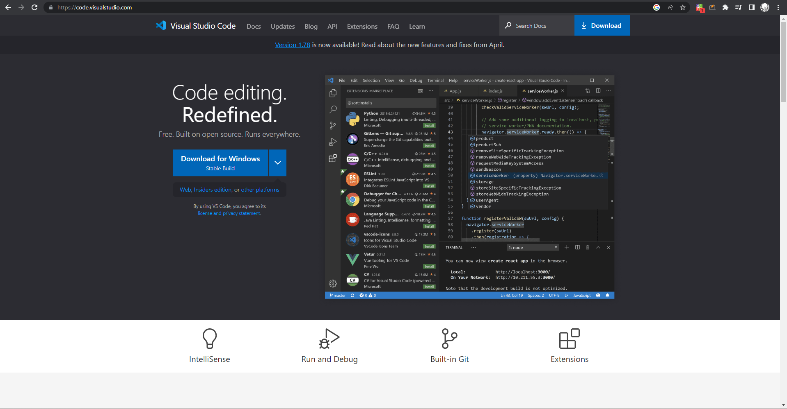

---
### Extension you must have

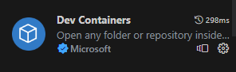
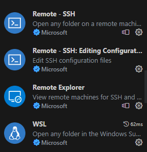

---

### Open your workspace in vscode

---

## <span style="color:white"> Click on the SSH </span>

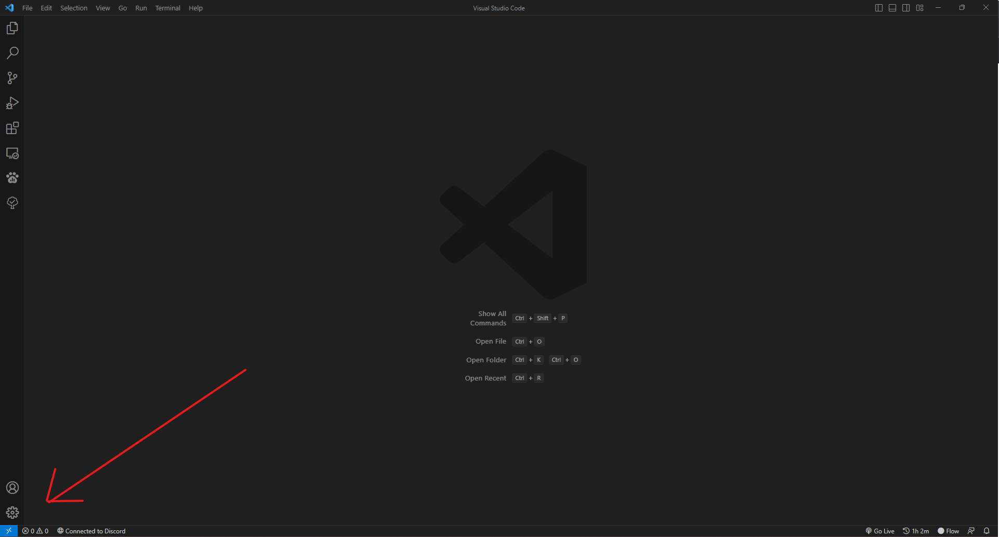

---

## <span style="color:white"> Add Dev Container Configuration Files </span>

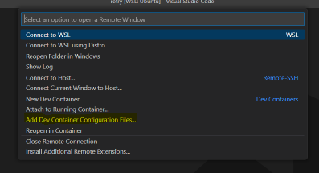

---

## <span style="color:white"> Python 3 & PostgreSQL </span>


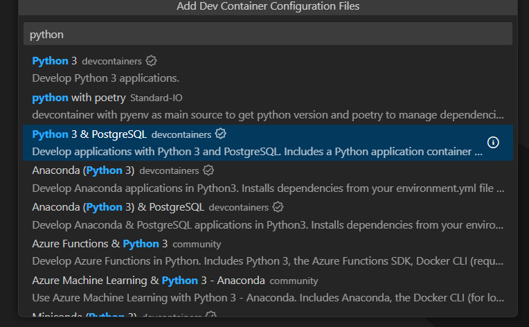

---

## <span style="color:white"> latest python version </span>

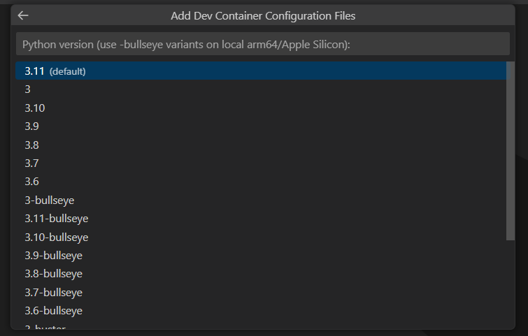

---

## Tick Poetry [via pipx]

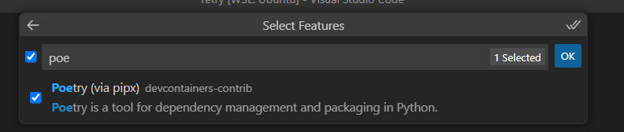

## Then OK
## keep default setting

---
## Reopen in Container

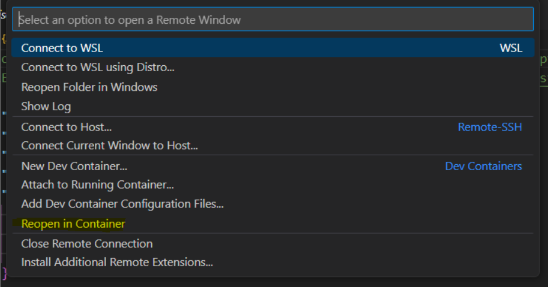

---

# Dance while you wait quitely ...

---

### Check that your vscode have ssh into dev container
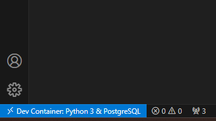

---

#### press

```ctrl + shift + ~```
#### to open a new terminal in dev container

---

#### Commands for 1st run


```sh
$ poetry config virtualenvs.in-project true

$ poetry init
```

Just Press Enter until the poetry init is done

---

### Edit your  pyproject.toml

```
[tool.poetry]
name = "<Project name>"
version = "0.1.0"
description = ""
authors = ["<your username> <your email>"]
readme = "README.md"

[tool.poetry.dependencies]

# Should be change according to your team requirement
# Avoid editing this by hand use poetry add <package> and poetry remove <package>

python = "^3.11"


[build-system]
requires = ["poetry-core"]
build-backend = "poetry.core.masonry.api"
```

---

### Add all the package need for the project


```sh
$ poetry add <package> ...
```

```sh
exmaple: $ poetry add django django-ninja psycopg2
```

---

### press
`f1` or `ctrl + shift + p`
to bring up vscode command pallete
there should be `>` at the start of the line

---

###### Change your python interpreter to poetry python (3 slides)

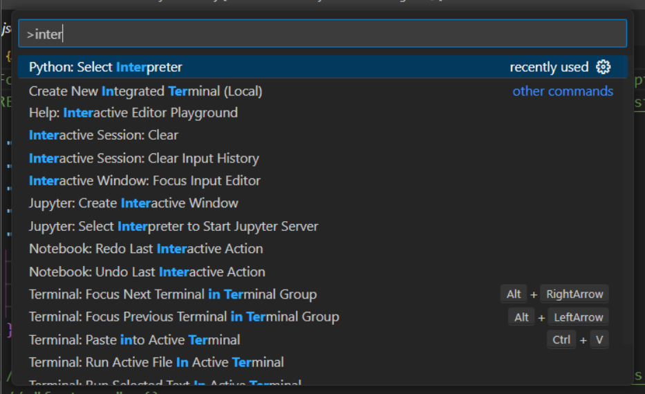

---

### if it doesn't show '.venv' or 'poetry'
### continue to next slide

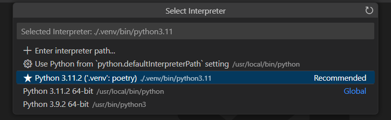

else
[click here](#21)

---

### Find ...

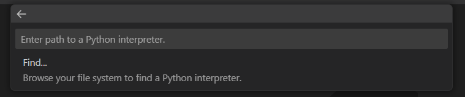

###### In .venv (ignore the initial url it should be your workspace path)

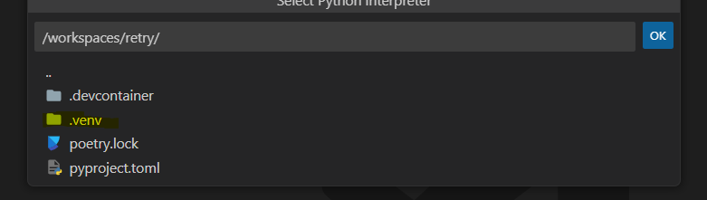

---

### Select the desired version of python

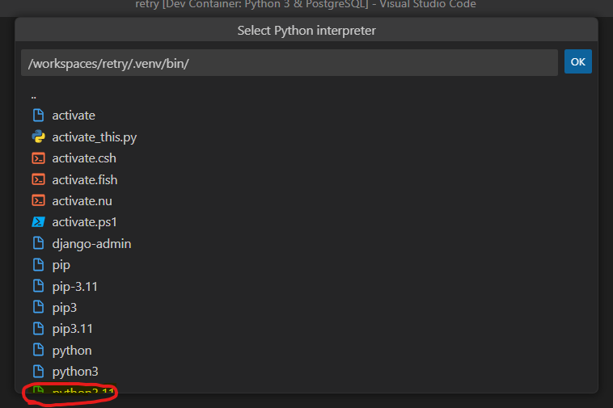

---
### close your current terminal and open a new one to update the enviroment
###### `ctrl + d`
(to close current terminal)
###### `ctrl + shift + ~`
(to open new terminal)

---

#### you should see the following output if you successfully install dev container

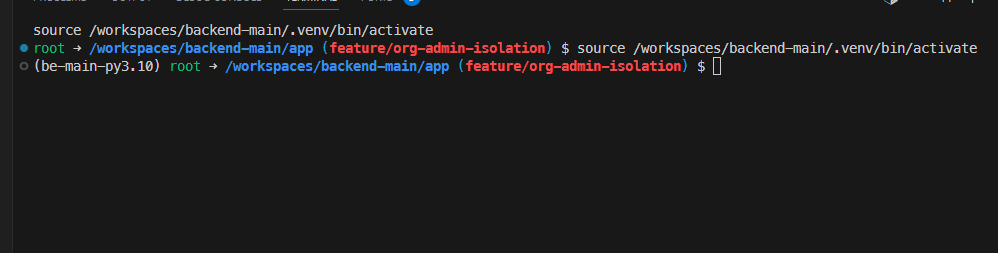

#### [else click here](#17)

---

# git ssh tokenss
### &
# ssh-keygen

---

#### If this show up when you git clone or git push

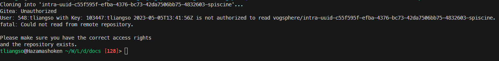

#### you may have not add ssh-key to your git cloud account

---

run the following commands in your vscode shell ternimal

<span style="font-weight:bold">IN YOUR DEV CONTAINER</span>

`$ ssh-keygen;`

##### press enter until the prompt is given back to you

---

run the following commands in your vscode shell ternimal

<span style="font-weight:bold">IN YOUR DEV CONTAINER</span>
`$ clear; cat ~/.ssh/id_rsa.pub;`

##### then copy (ctrl + c) the cated text and paste (ctrl + v) it in to your git cloud storage ssh token.

---

### If you do everything above correctly, you should/will have vscode in a dev container environment which you can connecto your team git cloud and clone down the project.